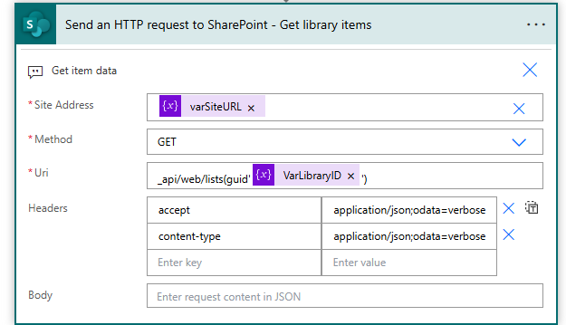

### Scenario
Fetching a Specific List by Library ID

## Objective
You want to retrieve the details of a specific SharePoint list using its unique Library ID stored in a variable.

### Steps

## Identify the Library ID

You have a SharePoint site with multiple lists, and you need to fetch the details of a list using its unique Library ID. The Library ID is stored in the variable VarLibraryID.

## Construct the HTTP Request

Use the SharePoint REST API to get the list details by specifying the Library ID in the URL.

## Execute the HTTP Request 

Make an HTTP GET request to the SharePoint REST API endpoint with the appropriate query parameters.


```http
Method: GET
Uri: _api/web/lists(guid'@{variables('VarLibraryID')}')
Headers: 
  Accept: application/json;odata=verbose
  Content-Type: application/json;odata=verbose
```



