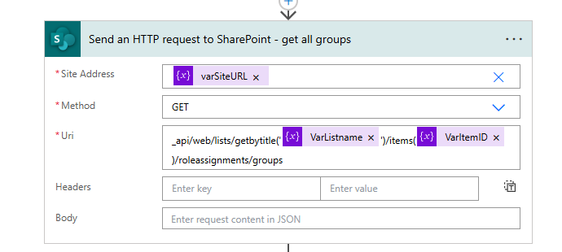
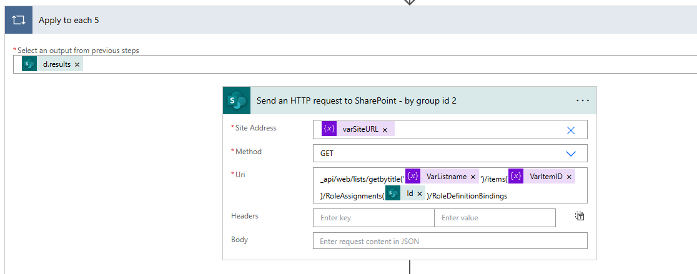
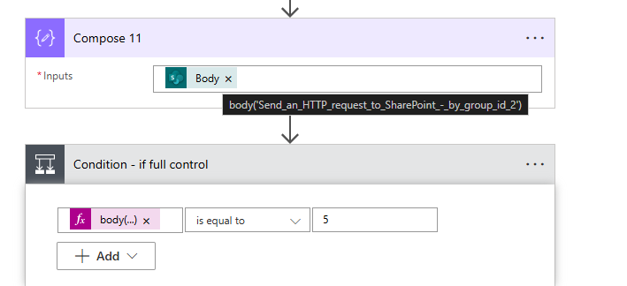
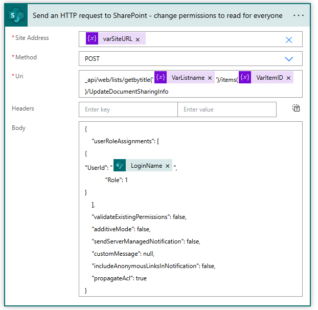

### Scenario
Revoke permissions to a document through the API.

Here comes the tricky part. There are 2 kind (that I found) role types on SharePoint.

  1. Roles from the Roletypekind
  - **None (Role = 0)**: No permissions assigned.
  - **Guest (Role = 1)**: Limited access, typically read-only.
  - **Reader (Role = 2)**: Can view items but not make changes.
  - **Contributor (Role = 3)**: Can add and edit items.
  - **WebDesigner (Role = 4)**: Can design and manage site content.
  - **Administrator (Role = 5)**: Full control over the site.

  2. Role (UserRoleAssignment).
  - **View (Role = 1)**: Grants read-only access to the document.
  - **Edit (Role = 2)**: Allows the user to edit the document.
  - **Owner (Role = 3)**: Grants full control over the document, including the ability to manage permissions.
  - **None (Role = 0)**: Removes any previously assigned permissions.

### Step 1 - You need to have broken inheritance first, otherwise this won't work.

## API call 1 - Get all the groups from SharePoint

```markdown
Method: Post
URI: _api/web/lists/getbytitle('@{variables('VarListname')}')/items(@{variables('VarItemID')})/UpdateDocumentSharingInfo
```




### Step 3 - API call 2 - Get the Group ID from all the groups on SharePoint

Method: Get




### Step 4 
I add a compose, and then a condition;

```markdown
if body('Send_an_HTTP_request_to_SharePoint_-_by_group_id_2')?['d']?['results'][0]?['RoleTypeKind'] is equal to 5 (Full control/Administrator) to not do anything.
```

If the group does not have full control, revoke by changing to Read.




### Step 5 - API call 3 - If no role nr 5 (full control) - do this action

```markdown
Method: Post

Uri: _api/web/lists/getbytitle('@{variables('VarListname')}')/items(@{variables('VarItemID')})/UpdateDocumentSharingInfo

Headers: none

Body:

{
  "userRoleAssignments": [
    {
      "UserId": "@{items('Apply_to_each')?['LoginName']}",
      "Role": 1
    }
  ],
  "validateExistingPermissions": false,
  "additiveMode": false,
  "sendServerManagedNotification": false,
  "customMessage": null,
  "includeAnonymousLinksInNotification": false,
  "propagateAcl": true
}
```

