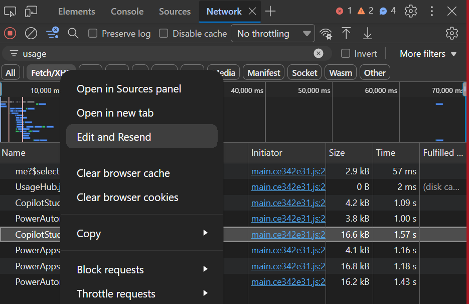

## Why did I need this?

Disclaimer, no AI was used to create this blogpost, but it did help me in finding this method.

I have a usecase, where I need all report metrics for usage from the Power Platform admin center.
The new log visuals are in preview, and dont (yet at the time of writing this) offer support in exporting these metrics.

There is no PowerShell script way to do this, no endpoint to call using Get (Allthough if you were to try, it wont return anything)

Power Platform does it's own in-browser query to https://tenantid.fa.tenant.api.powerplatform.com/usage/PowerAutomateUsage(from=2026-07-13,to=2026-08-10)?$top=50&$orderby=ActiveRuns%20desc&$count=true&api-version=1

If you try and manipulate in a browser call it wont work, and it wont accept a direct GET call, or PowerShell method to call it.

### How to get an extract of the Power Platform Usage (limit 28 days, refreshes every 24 hours)

1.  Go to the Power Platform Admin center (Make sure you have your Power Platform admin role active) - [PPAC Usage](https://admin.powerplatform.microsoft.com/manage/usage/summary/) 

2. Click on F12 (Developer tools), I'm using Edge for this, in Chrome you wont find this option.

3. Go to the Network Tab

4. Type in Usage in the filter

5. Refresh the page

6. Select your respective Copilot, Apps or Flows endpoint in the overview (Dont select the Time Series one, make sure to select the Usage)

7. Click on Edit and Resend

8. Take note of the parameters. It will only allow you to grab 100 items per time (it's set by default to top 50)

9. Set the top to 100

10. Add a new key under the existing ones with: $skip

11. Value: 0

12. Send the call

    It will give you the first 100, and show you in the oData count how many it grabbed.

13. Download the result

14. If for 220 total files, start with this, in your next call do Skip 100, Send the call and Download the json.

15. Then Skip 200, do the cal, click download.

16. Once you have all you need, merge the json files together, export to csv, whatever you want.

Et Voila, you now have all usage metrics, if not in a slightly tedious way, but it's something.

I'm sure this can automated somehow, but I did want to share.